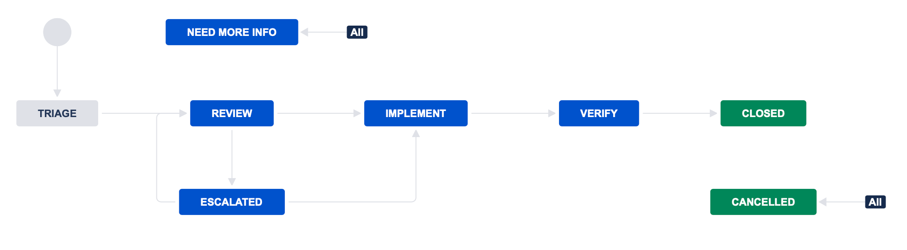

# Overview
This document highlights the process for change proposals made to the Cyber Domain Ontology (CDO). Required artifacts, workflows, class of change, approvals, and integration are covered herein.

A Jira Dashboard shall list active proposals with their timeframe based on the class of change. Email reminders will be sent as timeframes approach breach. 

# Artifacts
The following artifacts shall be produced and provided as part of the change proposal process.

| Artifact        | Description | Class 1 | Class 2 | Class 3 |
|-----------------|-------------|---------|---------|---------|
| Change Issue    | A GitHub Issue addressing the proposed change with required details identified below | X | X | X |
| Pull Request    | A GitHub Pull Request that includes the proposed change | X | X | X |
| Change Proposal | Confluence page addressing requirements identified below | X | | | 

# Workflow

- **`GITHUB`** Create Issue for Change Request (CR)
- **`GITHUB`** When available, submit Pull Request (PR) and associate it with the CR GitHub Issue
- **`JIRA`** Automatically creates ticket to administratively track CR
- **`JIRA`** All procedural comments should be posted to the Jira ticket
- **`GITHUB`** All technical and conceptual comments should be posted to the GitHub Issue
- **`JIRA`** Ticket transitions to **Triage** and is reviewed based on the criteria outlined below in Change Classes
- **`JIRA`** Ticket transitions to **Review** where it remains open for comment and review for a period of time outlined below in Change Classes
- **`JIRA`** If a ticket transitions to **Escalated** it will be reviewed at the next committee meeting
- **`JIRA`** If a ticket transitions to **Implement** the associated PR will be merged
- **`GITHUB`** Automatically merges pull request into the develop branch
- **`JIRA`** The **Verify** status will serve to confirm the merge was successful
- **`JIRA`** Ticket automatically transitions to **Closed** once all outstanding actions are completed
- **`GITHUB`** Automatically closes the CR GitHub Issue when Jira ticket is closed

# Change Classes
Categorizing changes into different classes allows low risk proposals to be integrated into ontologies more efficiently, while still allowing robust and thorough review of high-impact changes to ontologies and their infrastructures.

#### Workflow Impact
- If 3 voting members oppose the change request within the given timeline the request will escalate to committee for further deliberation. 
- If at any time during the open period more than 50% of voting members vote in favor of the proposed change the change request will auto-transition to implement.

## Class 1 (Major)
Class 1 changes include infrastructure changes or major restructuring of an ontology representation that will cause fundamental breaking impacts to adopters.

### Triage Criteria
- The change does not meet the criteria for a lower impact class change. 

### Workflow Impact
- Class 1 change requests will auto-transition to implement after a 30 calendar day review period unless a committee review is triggered as defined above.

## Class 2 (Minor)
Class 2 changes include non-infrastructure changes that involves minor breaks in classes, facets, or properties for adopters.

### Triage Criteria
- The change includes at least one modification or deletion that may cause any existing adopting implementations or tests to break.
- The change does not remove representation of a concept (though it may be moved or renamed).
- The change does not impact more than 25 combined objects, facets, and properties.
- The change does not establish a new namespace.
- The change does not alter the representation technology for the ontology (eg. OWL, SHACL). 

### Workflow Impact
- Class 2 change requests will auto-transition to implement after a 14 calendar day review period unless a committee review is triggered as defined above.

## Class 3 (Non-Breaking)
Class 3 changes include non-infrastructure changes that do not involve any breaking changes for adopters. This can include additions, alterations, or deletions.

### Triage Criteria
- The change is not expected to cause any existing adopting implementations or tests to break.

### Workflow Impact
- Class 3 change requests will auto-transition to implement after a 7 calendar day review period unless a committee review is triggered as defined above.

# Release Process
In order to help get changes out to the community as fast as possible, the following process for releasing new versions of the ontology shall be used.

- GitHub pull requests will be made against the `develop` branch, following the Git Flow model they have been.

### UCO

- Upon a branch being merged into `develop` or `main` or the creation of a tag, the GitHub Action will trigger adopting ontologies' actions to update to the latest version of UCO. 

### Adopting Ontologies (eg. CASE)
- A GitHub Action workflow will be configured to automatically bring the UCO submodule to the latest version. This will have a webhook that allows the UCO GitHub actions to update the like-named branches (`main`, `develop`, etc).

- Upon a branch being merged into the development branch (e.g.  `develop`), a “monolithic” ontology file will be built and included as an artifact in the GitHub Actions workflow with the version containing the Unix timestamp (eg. 0.5.0.1646158390).

- Upon a branch being merged into the default branch (e.g.  `main` or `master`) , a “monolithic” ontology file will be built and included as an artifact in the GitHub Actions workflow with the build version incremented (eg. 0.5.1).

- Upon the creation of a tag, a “monolithic” ontology file will be built and included as an artifact in the GitHub Actions workflow with the name of the tag as the version (eg. 0.6.0). This file will also be uploaded into the “Releases” section of the GitHub repository. 

