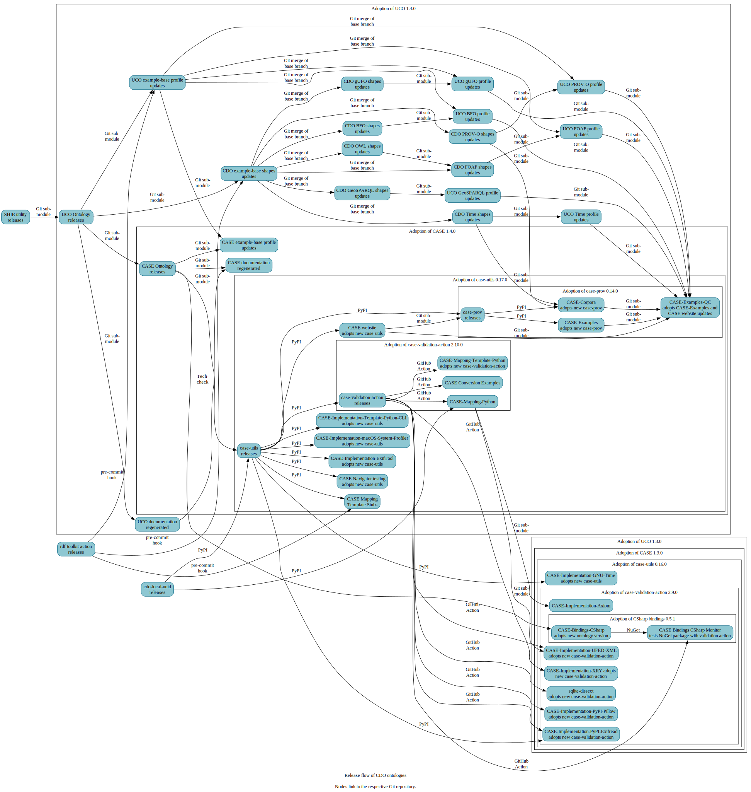

This page illustrates the release flow of CDO ontologies and consumer-projects of the ontologies.  The "trunk" of the flow follows this path:

* The [CASE ontology repository](https://github.com/casework/CASE) tracks [UCO's ontology repository](https://github.com/ucoProject/UCO) as a Git submodule, and creates releases with each release of UCO.
* The [CASE Python Utilities](https://github.com/casework/CASE-Utilities-Python) then compile a monolithic build of the CASE ontology, exporting that build via PyPI at [`case-utils`](https://pypi.org/project/case-utils/).
* A GitHub validation action, [`case-validation-action`](https://github.com/casework/CASE-Utilities-Python) references the new `case-utils` version as a `pip` dependency, and uses that new version for validation with GitHub Actions in projects that adopt `case-validation-action`.

The flow shows various practices with consuming the UCO and CASE ontologies, frequently as part of data validation in Continuous Integration workflows.

The flow is illustrated in the following figure.  The figure also serves as community progress notes on the various projects' upgrade status each time a release happens for UCO or something intermediary.  Each nested sub-graph represents projects that have reached some state of adoption.

The figure is SVG and interactive - text can be zoomed and searched, and nodes can be clicked to visit the corresponding GitHub repository.  To interact with the figure, click the figure and you will be navigated to the source SVG.

*(If this figure is in need of an update, please follow the directions [here](https://github.com/Cyber-Domain-Ontology/cdo.github.io/blob/main/CONTRIBUTE.md#maintaining-the-project-release-flow-diagram).)*

